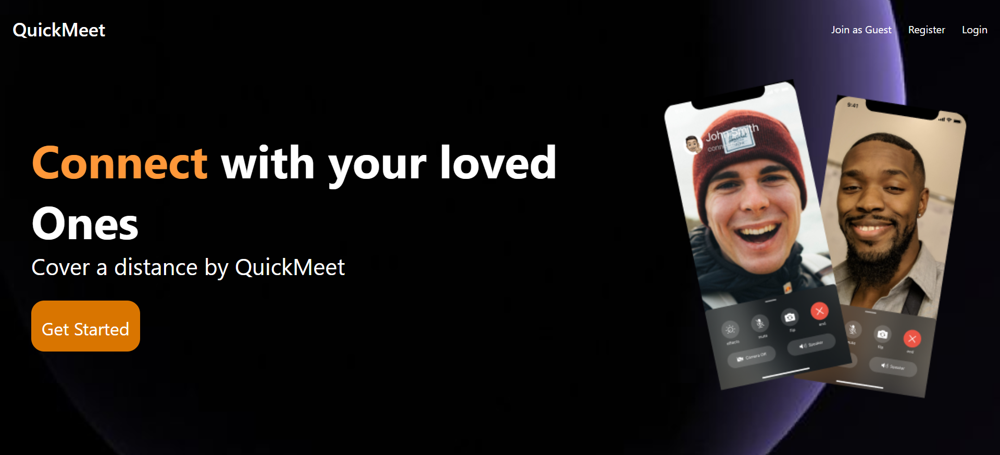
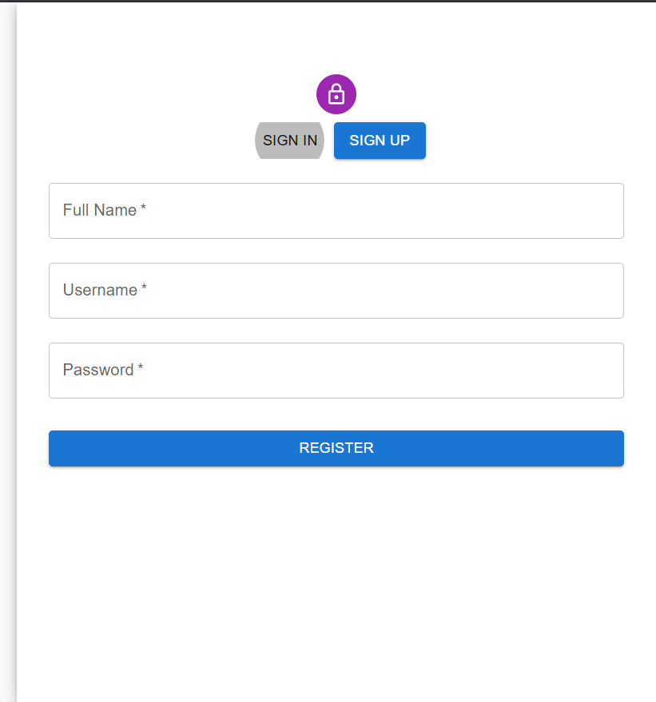
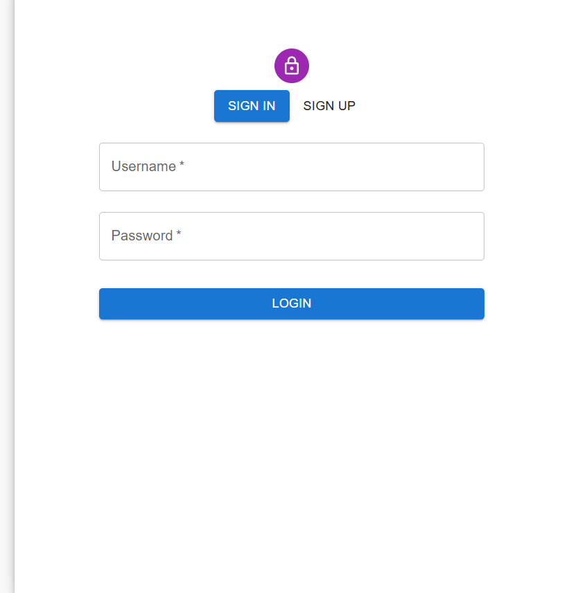
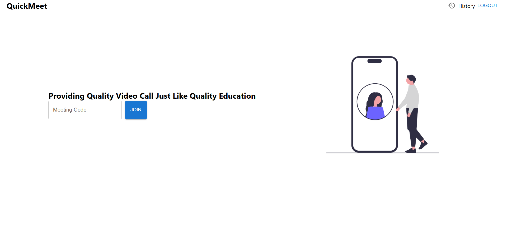
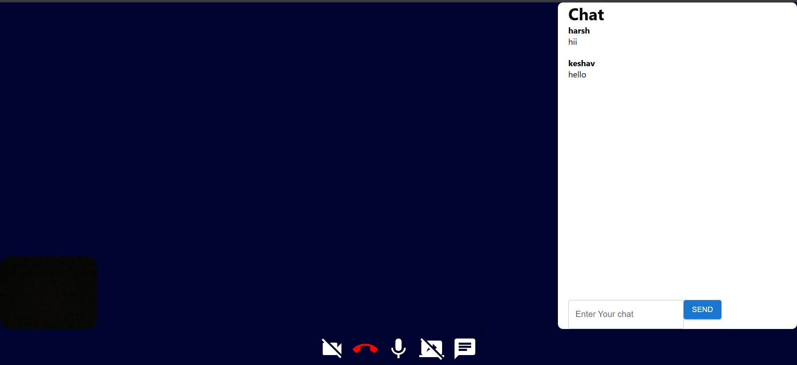
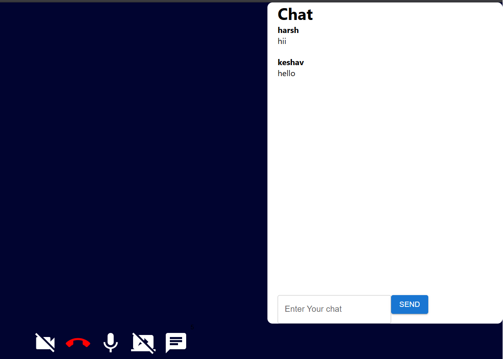

# QuickMeet 🎥

A full-stack **real-time video conferencing web application** built with the MERN stack, WebRTC, and Socket.IO. QuickMeet lets users register, create or join meeting rooms using unique codes, chat during calls, and track their meeting history — all in a clean, responsive UI.

---

## 🚀 Live Demo

> _Coming Soon_ — Deploy on Render / Vercel and update this link.

---

## 📸 Screenshots

Home Page


---

Signup


---

Signin


---

Enter Meeting Code


---

Meeting Room


---

Chat Panel


---

## ✨ Features

- 🔐 **User Authentication** — Register and login with bcrypt-hashed passwords and token-based session management
- 📹 **Real-Time Video/Audio Calls** — Peer-to-peer communication using WebRTC signaling via Socket.IO
- 💬 **In-Meeting Chat** — Live chat with message history replayed for late joiners
- 🔗 **Meeting Codes** — Create and share unique room codes to join calls instantly
- 📋 **Meeting History** — Logged-in users can view all their past meeting codes
- 👥 **Multi-Participant Support** — Multiple users can join the same meeting room
- 🔔 **Join/Leave Notifications** — Real-time user-joined and user-left events broadcast to all participants

---

## 🛠️ Tech Stack

### Frontend

| Technology           | Purpose                      |
| -------------------- | ---------------------------- |
| React 18             | UI framework                 |
| React Router v6      | Client-side routing          |
| Material UI (MUI v5) | Component library & styling  |
| Socket.IO Client     | Real-time events             |
| Axios                | HTTP requests to backend API |

### Backend

| Technology         | Purpose                                |
| ------------------ | -------------------------------------- |
| Node.js + Express  | REST API server                        |
| Socket.IO          | WebRTC signaling & real-time messaging |
| MongoDB + Mongoose | Database for users and meeting history |
| bcrypt             | Password hashing                       |
| crypto             | Token generation for sessions          |
| CORS               | Cross-origin request handling          |

---

## 📁 Project Structure

```
QuickMeet/
├── backend/
│   └── src/
│       ├── app.js                     # Express server + Socket.IO setup + MongoDB connection
│       ├── controllers/
│       │   ├── socketManager.js       # WebRTC signaling, chat, join/leave logic
│       │   └── user.controller.js     # Auth controllers (login, register, history)
│       ├── models/
│       │   ├── user.model.js          # User schema (name, username, password, token)
│       │   └── meeting.model.js       # Meeting schema (user_id, meetingCode, date)
│       └── routes/
│           └── users.routes.js        # API routes for auth and meeting history
│
└── frontend/
    └── src/                           # React application (components, pages, context)
```

---

## ⚙️ Getting Started

### Prerequisites

- Node.js v18+
- npm or yarn
- MongoDB Atlas account (or local MongoDB)

### 1. Clone the Repository

```bash
git clone https://github.com/23Harshy/QuickMeet.git
cd QuickMeet
```

### 2. Setup the Backend

```bash
cd backend
npm install
```

Create a `.env` file in the `backend/` directory:

```env
PORT=8000
MONGO_URI=your_mongodb_connection_string
```

Start the backend server:

```bash
npm run dev      # Development (with nodemon)
npm start        # Production
```

### 3. Setup the Frontend

```bash
cd frontend
npm install
npm start
```

The React app will start on `http://localhost:3000` and the backend runs on `http://localhost:8000`.

---

## 🔌 API Endpoints

Base URL: `/api/v1/users`

| Method | Endpoint            | Description                                            |
| ------ | ------------------- | ------------------------------------------------------ |
| `POST` | `/login`            | Login with username & password → returns session token |
| `POST` | `/register`         | Register a new user                                    |
| `POST` | `/add_to_activity`  | Save a meeting code to user history                    |
| `GET`  | `/get_all_activity` | Fetch all past meetings for a user                     |

---

## 🔄 Socket.IO Events

| Event          | Direction       | Description                                    |
| -------------- | --------------- | ---------------------------------------------- |
| `join-call`    | Client → Server | Join a meeting room by path/code               |
| `user-joined`  | Server → Client | Notifies all participants of a new joiner      |
| `signal`       | Client ↔ Server | WebRTC signaling (SDP/ICE exchange)            |
| `chat-message` | Client ↔ Server | Send/receive chat messages in a room           |
| `user-left`    | Server → Client | Notifies participants when someone disconnects |

---

## 🧠 How It Works

1. **Authentication** — Users register/login via REST API. A random hex token is stored in MongoDB and returned to the client for subsequent requests.
2. **Creating/Joining a Room** — Users generate or enter a meeting code. The frontend connects to a Socket.IO room identified by that code.
3. **WebRTC Signaling** — The server acts as a signaling relay. When a new user joins, the server emits `user-joined` to all peers, who then exchange SDP offers/answers and ICE candidates via the `signal` event to establish direct P2P video connections.
4. **Chat** — Messages are broadcast to all room participants and persisted in memory so late joiners receive the full chat history on connect.
5. **Meeting History** — After a call, the meeting code is saved to MongoDB via `add_to_activity` and can be retrieved on the history page.

## 👨‍💻 Author

**Harsh Yadav**

- GitHub: [@23Harshy](https://github.com/23Harshy)
- B.Tech Computer Science, Allenhouse Institute of Technology, Kanpur

---

## 📄 License

This project is open source and available under the [MIT License](LICENSE).
